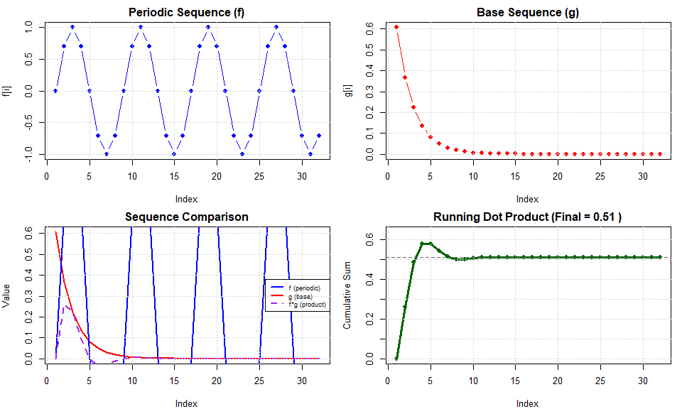

<!-- README.md is generated from README.Rmd. Please edit that file -->

# cyclic.coefs

<!-- badges: start -->

<!-- badges: end -->

**cyclic.coefs** provides tools for exploring series with periodic
coefficients through dot products. The package implements the
mathematical pattern:

$$\sum_{i=1}^{n} f_i \cdot g_i$$

where **f** is a periodic sequence (sine, cosine, triangle wave, etc.)
and **g** is a base sequence (harmonic, geometric, exponential, etc.).
This framework is fundamental to Fourier analysis and series expansions.

## Installation

Install the development version from GitHub:

``` r
# install.packages("pak")
pak::pak("randomplayables/cyclic.coefs")
```

## Quick Start

Combine a sine wave with exponential decay:

``` r
library(cyclic.coefs)

# Create a combination
res <- combine(
  .f = \(x) sin_cyc(),
  .g = \(x) exp_decay_g(rate = 0.5)
)

# View results
print(res)
#> Cyclic Coefficient Series Combination
#> ======================================
#> 
#> Dot Product (f * g): 0.5099433 
#> Sequence Length:     32 
#> 
#> First 6 element-wise products (f[i]*g[i]):
#> [1]  0.000000e+00  2.601300e-01  2.231302e-01  9.569650e-02  1.005218e-17
#> [6] -3.520477e-02
#> ... (26 more terms)
```

Visualize the interaction:

``` r
plot(res)
```



## Key Functions

**Periodic coefficients (.f functions):** - `sin_cyc()`, `cos_cyc()` -
Trigonometric sequences - `triangle_cyc()`, `sawtooth_cyc()`,
`square_cyc()` - Geometric waves - `pulse_cyc()` - Rectangular pulse
waves - `complex_cyc()` - Complex exponentials for Fourier analysis

**Base sequences (.g functions):** - `harmonic_g()` - Harmonic series
(1/n) - `power_g()` - Power sequences (n^p) - `geometric_g()` -
Geometric sequences (r^n) - `exp_decay_g()` - Exponential decay -
`fibonacci_g()`, `binomial_g()`, and more

## Classic Example: Fourier-like Series

``` r
# Sine with harmonic coefficients: Σ(1/n)sin(nx)
fourier_like <- combine(
  .f = \(x) sin_cyc(seq(0, 2*pi, length.out = 33)[-33]),
  .g = \(x) harmonic_g(1:32)
)

summary(fourier_like)
#> Cyclic Coefficient Series Combination
#> ======================================
#> 
#> Dot Product (f * g): 0.9785916 
#> 
#> Periodic Sequence (f):
#>   Length:   32 
#>   Range:   [-1, 1]
#>   Mean:     2.170098e-18 
#>   SD:       0.7184212 
#> 
#> Base Sequence (g):
#>   Length:   32 
#>   Range:   [0.03125, 1]
#>   Mean:     0.126828 
#>   SD:       0.1883234 
#> 
#> Element-wise Products (f[i]*g[i]):
#>   Range:   [-0.04086605, 0.1414214]
#>   Mean:     0.03058099 
#>   SD:       0.06703437
```
